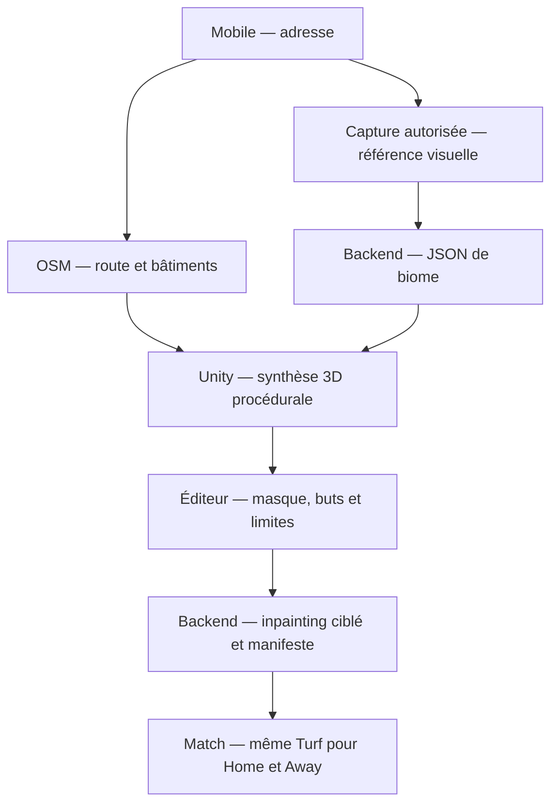

# Street Turf — Global Football

Proof of Concept mobile Unity 6 pour un jeu de football de rue 3D. Le dépôt contient un prototype Android autonome, l'analyseur de biome, l'inpainting ciblé et le workflow GitHub Actions qui produit un APK.

## Ce que le PoC permet déjà de valider

- génération d'une rue 3D depuis un JSON de biome simulé ;
- matériaux procéduraux pour route, trottoirs et façades ;
- physique arcade du ballon adaptée à l'asphalte ;
- commandes tactiles : joystick, tir chargé, passe, sprint et tacle ;
- cages, détection de but, score et match de trois minutes ;
- peinture tactile d'un masque noir et blanc sur un objet 3D ;
- placement des buts et des limites du Home Turf ;
- API FastAPI d'analyse Vision et d'inpainting sous le masque seulement ;
- manifeste Home/Away versionné avec contrôle SHA-256 ;
- compilation Android et publication de l'APK comme artifact GitHub.

## Livrables principaux

| Livrable | Fichier |
| --- | --- |
| Analyseur Vision Python | [`backend/vision_api.py`](backend/vision_api.py) |
| API d'inpainting | [`backend/app/main.py`](backend/app/main.py) |
| Générateur de rue | [`StreetGenerator.cs`](unity/Assets/StreetTurf/Scripts/Poc/StreetGenerator.cs) |
| Joueur mobile | [`MobilePlayerController.cs`](unity/Assets/StreetTurf/Scripts/Poc/MobilePlayerController.cs) |
| Physique du ballon | [`BallPhysics.cs`](unity/Assets/StreetTurf/Scripts/Poc/BallPhysics.cs) |
| Score et chronomètre | [`GameManager.cs`](unity/Assets/StreetTurf/Scripts/Poc/GameManager.cs) |
| Pinceau de masque 3D | [`SurfaceMaskPainter.cs`](unity/Assets/StreetTurf/Scripts/TurfEditor/SurfaceMaskPainter.cs) |
| Build APK | [`.github/workflows/build-android.yml`](.github/workflows/build-android.yml) |

## Architecture hybride



Le PoC simule OSM et le JSON dans Unity afin que l'APK reste testable sans compte cloud. En production, le serveur remplace ces données simulées par une topologie OSM normalisée et un biome validé.

## Tester l'APK depuis un téléphone

Le workflow est lancé à chaque push sur `main`. Une licence Unity Personal doit toutefois être ajoutée une seule fois aux secrets GitHub avant que Unity puisse compiler. Suivez le guide [**GitHub mobile → APK**](docs/GITHUB_MOBILE.md).

L'APK apparaîtra dans l'onglet **Actions**, sous l'artifact `StreetTurf-Android-APK`, et restera téléchargeable pendant 14 jours.

## Lancer le backend

Python 3.11 ou plus récent :

```bash
cd backend
python -m venv .venv
source .venv/bin/activate
pip install -e ".[dev]"
uvicorn vision_api:app --reload --port 8001
```

Le mode `demo` ne demande aucune clé. Testez le contrat JSON à l'adresse `http://localhost:8001/v1/vision/demo-biome`.

Pour l'API d'inpainting simulée :

```bash
uvicorn app.main:app --reload --port 8000
```

Les détails sont dans [`backend/README.md`](backend/README.md).

## Règle juridique importante sur les images

Avec les conditions standard de Google Maps Platform, le jeu ne doit pas télécharger une image Street View ou une tuile 3D, l'envoyer à une IA, la modifier puis la conserver comme terrain. L'architecture sépare donc :

1. Google Places/Maps pour la recherche et l'aperçu temporaire avec attribution ;
2. une capture appartenant au joueur ou une ressource disposant d'une licence de transformation pour l'analyse et l'inpainting.

L'analyseur refuse volontairement les URL Google. Une licence commerciale négociée séparément pourrait faire évoluer cette contrainte.

- [Règles Street View Static API](https://developers.google.com/maps/documentation/streetview/policies)
- [Règles Map Tiles API](https://developers.google.com/maps/documentation/tile/policies)

## Limite technique de l'inpainting

L'inpainting répare des pixels ; il ne reconstruit pas le volume 3D caché derrière une voiture. Le terrain utilise donc deux couches :

- décor visuel nettoyé ;
- géométrie physique déterministe : route, buts, barrières et murs invisibles.

Cette séparation assure la même collision sur les mobiles Home et Away.

## Documentation

- [Architecture complète](docs/ARCHITECTURE.md)
- [Guide GitHub sur mobile](docs/GITHUB_MOBILE.md)
- [Backend et exemples API](backend/README.md)
- [Projet Unity](unity/README.md)
- [Exemple de manifeste Home Turf](shared/examples/home-turf-manifest.json)

## Avant une production publique

Le PoC n'est ni un jeu 5v5 complet ni un service prêt à accueillir des joueurs. Il faudra notamment ajouter : authentification, modération, stockage objet/CDN, file de workers GPU, base PostgreSQL, serveur de match autoritaire/rollback, IA des coéquipiers, OSM réel, consentement et suppression RGPD, catalogue cosmétique et validation des achats.
