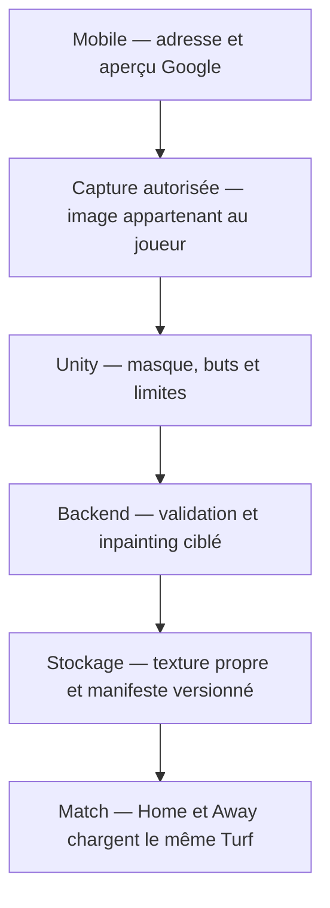
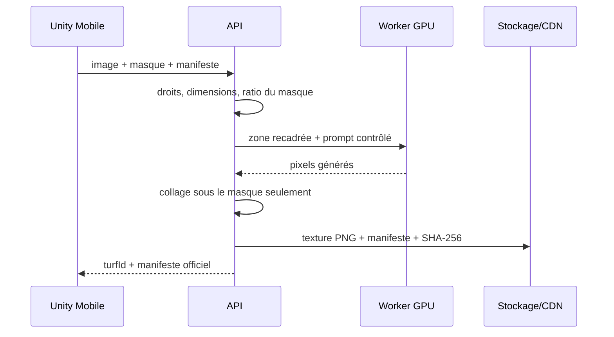
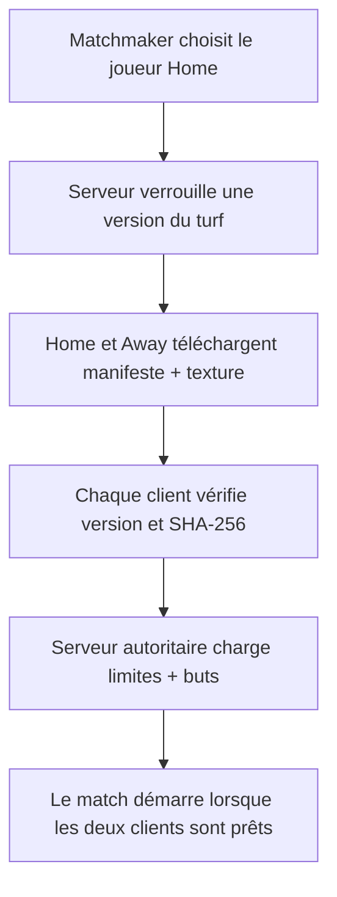
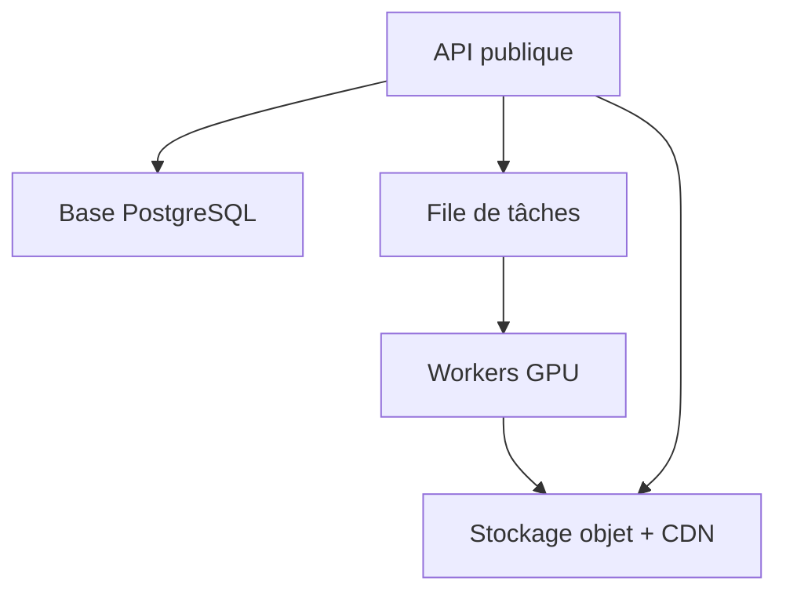

# Architecture hybride — Joueur + IA

## 1. Principe général

Le joueur prend les décisions créatives. L'IA n'essaie ni de détecter les voitures, ni de comprendre toute la rue. Elle remplit seulement les pixels blancs du masque envoyé par le mobile.

Google n'entre jamais dans la branche d'inpainting avec les conditions standard. Seuls le `placeId` et une référence interne non sensible servent à relier l'aperçu à la création.

## 2. Flux utilisateur de création

| Écran | Action du joueur | Validation obligatoire |
| --- | --- | --- |
| Recherche | Saisit une rue et choisit un résultat Google Places | Rue publique autorisée ; adresse exacte non envoyée au joueur Away |
| Aperçu | Observe temporairement la zone avec attribution Google | Aucun cache durable de l'image ou des tuiles |
| Capture | Importe ou prend une photo/panorama qu'il a le droit de modifier | Consentement, suppression EXIF, floutage visages/plaques |
| Masque | Peint en rouge les zones à effacer | Le masque blanc ne doit pas dépasser une limite configurée |
| Terrain | Pose deux cages et trace les limites | Dimensions minimales/maximales, absence de chevauchement |
| Confirmation | Compare avant/après et confirme | Contrôle humain et modération automatique |
| Publication | Donne un nom au Home Turf | Pseudo/graffiti filtrés et provenance enregistrée |

## 3. Séquence de génération

Pour le POC, l'API appelle le fournisseur localement. En production, `A -> Q` devient une file de travaux afin d'absorber les pics de charge et d'isoler les GPU.

## 4. Composants

### Mobile Unity

- `AddressSelection` : Google Places pour chercher ; ne conserve que l'identifiant autorisé.
- `CaptureImport` : prend/import une image autorisée, retire les métadonnées privées.
- `SurfaceMaskPainter` : raycast écran vers `MeshCollider`, conversion UV vers pixel, écriture du masque.
- `GoalPlacementController` : déplace les buts sur la couche de sol jouable.
- `BoundaryPlacementController` : enregistre un polygone fermé de 4 à 32 points.
- `HomeTurfUploadClient` : envoie image, PNG du masque et JSON.
- `HomeTurfLoader` : télécharge et vérifie le SHA-256 avant le match.
- `Gameplay` : personnage, ballon et caméra ; l'état compétitif doit devenir autoritaire côté serveur.

### Backend HTTP

- contrôle du type, du poids, des dimensions et du ratio du masque ;
- validation du manifeste et de la provenance ;
- calcul de la boîte englobante du masque avec une marge ;
- appel au fournisseur d'inpainting sur ce petit recadrage ;
- composition du résultat uniquement sur les pixels blancs ;
- stockage d'une texture propre et d'un manifeste immuable/versionné.

### Worker GPU de production

- une seule copie du modèle par processus GPU ;
- file de tâches avec idempotence par clé de requête ;
- limite de concurrence par GPU ;
- temps maximal et reprise ;
- variantes de modèle configurées côté serveur, jamais choisies librement par le mobile.

### Données et CDN

Chaque version publiée contient :

- `turfId` et `schemaVersion` ;
- URL signée ou CDN de la texture nettoyée ;
- SHA-256 de cette texture ;
- dimensions du terrain dans un repère local en mètres ;
- positions/rotations des buts ;
- polygone des limites ou murs invisibles ;
- identifiants de cosmétiques autorisés ;
- provenance et version du traitement, conservées côté serveur.

Le client Away ne reçoit pas l'adresse exacte, la capture originale, le masque ni les coordonnées GPS précises.

## 5. Match Home / Away

Règle importante : le Home ne transmet jamais directement son fichier au Away. Le serveur fournit une version modérée, signée et identique aux deux clients.

Pour un premier match amical, Unity Multiplayer Services peut gérer la session et Relay. Pour un classement, la physique du ballon, les buts, les tacles et le chronomètre doivent être validés par un serveur dédié. Unity a arrêté Multiplay Hosting le 31 mars 2026 ; le fournisseur d'hébergement doit donc rester interchangeable.

## 6. Physique et rendu

### Couche visuelle

- texture propre 2D ou panorama ;
- décor sans collision compétitive ;
- LOD et compression ASTC/ETC2 sur mobile ;
- aucun changement de texture pendant un match classé.

### Couche jouable

- sol low-poly avec matériau physique urbain ;
- limites définies par un polygone serveur ;
- murs invisibles construits depuis ce polygone ;
- buts préfabriqués avec dimensions normalisées ;
- obstacles décoratifs autorisés seulement hors de la zone de jeu.

Cette couche résout le problème fondamental suivant : supprimer les pixels d'une voiture ne supprime pas sa géométrie 3D.

## 7. Monétisation sans avantage compétitif

| Cosmétique | Donnée stockée | Règle |
| --- | --- | --- |
| Graffiti | `graffitiSku` + texte modéré | Rendu serveur ou gabarits approuvés ; aucun lien/insulte |
| Filets néon | `goalNetSku` | Même collider et mêmes dimensions que le filet gratuit |
| Nuit | `weatherSku = night` | Éclairage lisible pour les deux joueurs |
| Pluie | `weatherSku = rain` | Effet visuel/audio seulement en classé ; friction identique |

Les achats sont vérifiés côté serveur. Le manifeste contient des SKU, jamais un chemin d'asset fourni par le client.

## 8. Sécurité, vie privée et modération

- Ne pas présenter le mode Home comme l'adresse personnelle réelle du joueur.
- Décaler ou supprimer les coordonnées précises envoyées à l'adversaire.
- Retirer les EXIF dès la réception.
- Flouter visages et plaques avant stockage, même si le joueur ne les masque pas.
- Refuser les écoles, propriétés privées sensibles et zones interdites selon les règles du jeu.
- Scanner graffiti, pseudo et images générées avant publication.
- Chiffrer le stockage, expirer l'original après traitement et offrir la suppression du Turf.
- Signer les manifests et limiter les URL dans le temps.
- Journaliser la provenance et le consentement sans exposer l'adresse aux joueurs.

## 9. API de cette phase

| Méthode | Route | Fonction |
| --- | --- | --- |
| `GET` | `/health` | Vérifie que l'API répond |
| `POST` | `/v1/inpaint` | Retourne directement un PNG nettoyé |
| `POST` | `/v1/home-turfs` | Génère, stocke et publie un Home Turf de POC |
| `GET` | `/v1/home-turfs/{id}` | Retourne le manifeste officiel |
| `GET` | `/v1/home-turfs/{id}/environment` | Retourne la texture vérifiable |

## 10. Passage en production

Ajouts obligatoires : authentification, quotas, antivirus, détection de contenu privé, modération, PostgreSQL, stockage objet, CDN, file GPU, observabilité, sauvegardes, suppression RGPD et serveur de match autoritaire.

## 11. Références techniques

- [Unity `RaycastHit.textureCoord`](https://docs.unity3d.com/ScriptReference/RaycastHit-textureCoord.html) : nécessite un `MeshCollider` et un mesh lisible dans le build.
- [Diffusers — Inpainting](https://huggingface.co/docs/diffusers/en/using-diffusers/inpaint) : blanc = zone modifiée, noir = zone conservée.
- [Unity Multiplayer Services SDK](https://docs.unity.com/en-us/mps-sdk) : sessions, Lobby, Matchmaker et Relay.
- [Unity Matchmaker](https://docs.unity.com/en-us/matchmaker) : migration nécessaire après l'arrêt de Multiplay Hosting.
